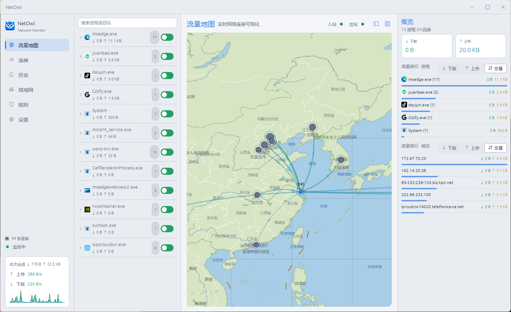

<p align="center"><a href="README.md">简体中文</a> | <strong>English</strong></p>

# NetOwl

  

NetOwl is a network connection monitor for Windows, inspired by Little Snitch on macOS: it shows you where every application is sending your data. The core experience is the **traffic map** — every network connection rendered in real time on a world map, centered on your machine.

> The project is in its early scaffold stage: the UI and simulated data already run, while real data collection and interception are delivered step by step following the roadmap.



## Features

Implemented:

- **Traffic map** — live process connections on a world map: arc links, animated inbound/outbound particles, pulsing nodes aggregated by connection count, hover for per-city details
- **Connection list** — active connections sorted by traffic: process, protocol, remote address, geolocation, upload/download volume
- **System tray** — stays in the background, closing the window minimizes to tray, left click to restore
- **Multi-language** — fluent-based UI localization with a language switcher in Settings, supporting hot-loading of external translation files

Planned:

- Real connection collection (ETW / TCP tables, no driver required)
- Allow/deny interception (WFP) with prompt dialogs
- Rule engine and persistence
- macOS / Linux support

## Build & Run

Requires a Rust stable toolchain:

```bash
cargo run --release
```

Currently Windows 10+ only (the UI renders Chinese text using the system bundled Microsoft YaHei font).

## Tech Stack

- **GUI**: egui/eframe (immediate mode, pure-Rust GPU-drawn rendering, no webview)
- **Tray**: tray-icon + muda
- **Localization**: fluent-bundle
- Icons and other resources are embedded at compile time (`include_bytes!`); the release artifact is a single file with no resource directory required

See [AGENTS.md](AGENTS.md) for development conventions and architecture notes.

## License

[GPL-3.0](LICENSE)
